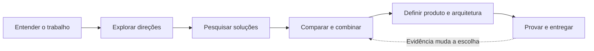

<div align="center">

# Out of the Box

### Criatividade aplicada a produtos B2B. Arquitetura com propósito.

Uma skill para agentes que conecta **design de produto**, **pesquisa técnica** e **combinação criteriosa de bibliotecas** — da primeira hipótese à implementação.

[](https://github.com/mateuxcv/skill-out-of-the-box/actions/workflows/validate.yml)
[](https://opencode.ai/docs/skills/)
[](https://agentskills.io/specification)

[Começar](#começar) · [Como funciona](#como-funciona) · [Exemplos](#exemplos-de-uso) · [Documentação](#documentação) · [Contribuir](#contribuir)

</div>

---

## Por que esta skill existe?

Uma boa aplicação empresarial começa pelo trabalho que precisa ser feito: investigar uma divergência, revisar um contrato, aprovar um fornecedor ou decidir o próximo passo de uma operação.

**Out of the Box** orienta o agente a explorar maneiras diferentes de resolver esse trabalho, pesquisar soluções além do repertório habitual e escolher uma composição técnica que faça sentido para o projeto.

> **Amplitude na exploração. Rigor na seleção. Simplicidade na execução.**

O resultado esperado é uma experiência com diferencial concreto, sustentada por evidências e por uma arquitetura que a equipe consiga manter.

## O que você encontra aqui

| Capacidade | Aplicação prática |
| --- | --- |
| **Exploração criativa** | Transferência de padrões entre domínios, inversão de fluxos, subtração de etapas e recombinação de capacidades. |
| **Pesquisa atual** | GitHub Trending, busca orientada ao problema, documentação oficial, releases e registros de pacotes. |
| **Seleção de bibliotecas** | Comparação por adequação, compatibilidade, manutenção, custo total e alternativas já disponíveis na stack. |
| **Design B2B** | Hierarquia, densidade de informação, ações contextuais, teclado, estados de interface e identidade visual. |
| **Arquitetura enxuta** | Responsabilidades claras, fonte de verdade definida e dependências com contribuição demonstrável. |
| **Execução verificável** | Experimentos pequenos, critérios de sucesso e implementação proporcional ao pedido. |

## Começar

### Requisitos

- **OpenCode** instalado, com acesso à ferramenta de skills.
- **Git** para clonar este repositório, ou GitHub CLI para usar `gh repo clone`.
- Acesso web no agente para pesquisa atual de soluções.
- **Python 3** apenas para executar o validador local; a skill em si é composta por Markdown.

### 1. Clone o repositório

```bash
git clone https://github.com/mateuxcv/skill-out-of-the-box.git
cd skill-out-of-the-box
```

Se você usa GitHub CLI:

```bash
gh repo clone mateuxcv/skill-out-of-the-box
cd skill-out-of-the-box
```

### 2. Abra o OpenCode

```bash
opencode
```

A skill já está no diretório de descoberta deste projeto:

```text
.opencode/skills/out-of-the-box/SKILL.md
```

Se o OpenCode já estava aberto, **feche e reinicie a sessão** para atualizar as skills disponíveis.

### 3. Dê um problema concreto ao agente

```text
Use a skill out-of-the-box para criar uma proposta de portal B2B de fornecedores.
Explore abordagens diferentes de experiência, consulte o GitHub Trending e
fontes oficiais, e compare bibliotecas com a stack existente.
Escolha uma arquitetura simples e explique o diferencial do fluxo principal.
```

Para desenvolver o produto, acrescente o escopo desejado, as restrições da stack e o pedido de implementação.

### Instalar em outro projeto ou globalmente

Copie a pasta **inteira** `.opencode/skills/out-of-the-box/`, incluindo `references/` e `assets/`, para o destino escolhido:

| Escopo | Destino |
| --- | --- |
| Outro projeto | `<seu-projeto>/.opencode/skills/out-of-the-box/` |
| Global — macOS/Linux | `~/.config/opencode/skills/out-of-the-box/` |
| Global — Windows | `%USERPROFILE%\.config\opencode\skills\out-of-the-box\` |

Crie o diretório de destino se necessário. Caso já exista uma versão da skill, compare os arquivos antes de substituí-la. Reinicie o OpenCode após a instalação.

O agente pode reconhecer pedidos pela descrição da skill. Para solicitar seu uso explicitamente, inclua **“Use a skill out-of-the-box”** no prompt.

## Como funciona



### 1. Entender antes de escolher

Identifica quem opera, quem compra, qual é o atrito atual, como observar uma melhoria e quais restrições moldam o projeto.

### 2. Explorar direções distintas

Considera uma solução essencial, uma inspiração transferida de outro domínio e uma recombinação de capacidades. As alternativas variam o mecanismo do trabalho, e não apenas a aparência.

### 3. Pesquisar com evidência

Usa Trending como fonte de descoberta e verifica os finalistas em fontes primárias. Registra o que foi consultado e distingue fatos, hipóteses e compatibilidades ainda não demonstradas.

### 4. Combinar com intenção

Para cada combinação, o agente precisa responder:

> A resolve o quê? B resolve o quê? O que as duas permitem juntas? Como se integram? Qual é o custo adicional? O que perdemos sem B?

A comparação inclui recursos nativos e dependências que o projeto já possui.

### 5. Definir uma solução coesa

Escolhe uma interação distintiva, uma direção visual relacionada ao domínio e limites arquiteturais suficientes para organizar a implementação.

### 6. Provar e entregar

Testa primeiro a incerteza decisiva. Quando o pedido é de desenvolvimento, segue até a implementação e a verificação do escopo solicitado.

## Um exemplo concreto

**Problema:** operadores de conciliação financeira alternam entre várias telas para investigar divergências.

| Direção | Proposta |
| --- | --- |
| Essencial | Aproveitar a tabela existente, com filtros salvos e ações em lote. |
| Transferência | Criar uma caixa de entrada de exceções com evidências lado a lado. |
| Recombinação | Unir comparação de registros, regras explicáveis e prévia de resolução. |

Se a maior dor for a troca de contexto, a caixa de entrada pode ser o melhor primeiro passo. Regras e novas bibliotecas entram quando houver uma necessidade demonstrável.

**Experimento possível:** concluir casos representativos e comparar passos, recuperação de erros e navegação por teclado com o fluxo atual.

*Exemplo ilustrativo: não representa um estudo com clientes nem um ganho já medido.*

## Exemplos de uso

### Design de uma experiência operacional

```text
Use a skill out-of-the-box para redesenhar a triagem de chamados empresariais.
O usuário trabalha por teclado e precisa comparar muitos itens.
Proponha uma interação distintiva e desenvolva o fluxo com seus estados.
Preserve a identidade visual e os componentes existentes.
```

### Pesquisa e composição técnica

```text
Use a skill out-of-the-box para avaliar soluções de revisão de contratos.
Pesquise bibliotecas de comparação de documentos e anotações contextuais.
Verifique as versões e o contrato entre as partes antes de recomendar a combinação.
Compare também com uma implementação menor usando a stack atual.
```

### Criatividade sob restrições

```text
Pense fora da caixa para melhorar este portal de fornecedores.
Não adicione dependências nem serviços.
Concentre o diferencial no fluxo, na hierarquia da informação e na redução de etapas.
Implemente a melhoria escolhida.
```

### Construção de produto

```text
Use a skill out-of-the-box para desenvolver um fluxo B2B de aprovação de compras.
Inspecione a stack atual, explore abordagens distintas e pesquise soluções pertinentes.
Escolha uma arquitetura enxuta, teste a integração mais arriscada e conclua
o fluxo de criação, revisão e aprovação, com tratamento de erros.
```

## Documentação

| Documento | Quando consultar |
| --- | --- |
| [SKILL.md](.opencode/skills/out-of-the-box/SKILL.md) | Fluxo principal, critérios de atuação e entrega. |
| [Métodos criativos](.opencode/skills/out-of-the-box/references/creative-methods.md) | Analogias, inversão, subtração e matriz de recombinação. |
| [Pesquisa e seleção](.opencode/skills/out-of-the-box/references/research-and-selection.md) | Fontes, evidências, avaliação de candidatos e prova de integração. |
| [Design B2B e arquitetura](.opencode/skills/out-of-the-box/references/b2b-design-and-architecture.md) | Interações, identidade visual, estados e fronteiras técnicas. |
| [Template de decisão](.opencode/skills/out-of-the-box/assets/decision-brief.md) | Registro de decisões extensas de produto e arquitetura. |
| [Avaliação comportamental](.opencode/skills/out-of-the-box/references/evaluation.md) | Dez cenários com resultados esperados e critérios de falha. |
| [Guia de contribuição](CONTRIBUTING.md) | Como propor melhorias e verificar mudanças. |

O conteúdo é organizado por **carregamento progressivo**: o agente recebe o fluxo principal e consulta referências quando a tarefa exige mais profundidade.

## Estrutura do repositório

```text
.
├── .github/
│   └── workflows/
│       └── validate.yml
├── .opencode/
│   └── skills/
│       └── out-of-the-box/
│           ├── SKILL.md
│           ├── references/
│           │   ├── creative-methods.md
│           │   ├── research-and-selection.md
│           │   ├── b2b-design-and-architecture.md
│           │   └── evaluation.md
│           └── assets/
│               └── decision-brief.md
├── scripts/
│   └── validate_skill.py
├── CONTRIBUTING.md
└── README.md
```

## Qualidade e avaliação

Execute na raiz do repositório:

```bash
python scripts/validate_skill.py
```

O validador verifica os arquivos esperados, o formato de frontmatter utilizado, o nome da skill, limites de tamanho e links locais na skill e no README. Usa apenas a biblioteca padrão do Python.

A mesma verificação roda no **GitHub Actions** em pushes e pull requests para `main`.

### O que cada avaliação demonstra

| Camada | Cobertura |
| --- | --- |
| Validação estrutural | Organização e integridade básica dos documentos. |
| Cenários comportamentais | Uso da skill em sessões novas, com revisão da resposta e das ferramentas acionadas. |
| Validação de produto | Experimentos e métricas do projeto em que a skill for aplicada. |

O validador não é um parser YAML geral. Os dez cenários comportamentais são um protocolo de avaliação manual; passar na validação estrutural não significa que esses cenários foram executados.

## Perguntas frequentes

<details>
<summary><strong>A skill exige novas bibliotecas?</strong></summary>

Não. Reutilizar a stack ou usar recursos nativos pode ser a melhor decisão. Toda dependência precisa ter uma responsabilidade clara e justificar seu custo.

</details>

<details>
<summary><strong>Ela sempre consulta o GitHub Trending?</strong></summary>

O fluxo completo inclui a consulta atual. Em tarefas rápidas, a pesquisa é proporcional à decisão; um pedido explícito de consulta também deve ser atendido. Sem acesso web, o agente deve informar a limitação e identificar recomendações não verificadas.

</details>

<details>
<summary><strong>Ela funciona em outros agentes?</strong></summary>

Os arquivos seguem o formato Agent Skills. A instalação e o fluxo documentados aqui são voltados ao OpenCode. Outros agentes precisam suportar esse formato e oferecer as ferramentas necessárias; a compatibilidade operacional com eles não foi validada neste projeto.

</details>

<details>
<summary><strong>Preciso configurar um MCP ou instalar pacotes?</strong></summary>

A skill é composta por instruções Markdown e não exige um MCP específico. Pesquisa, edição e testes dependem das ferramentas já disponíveis no agente. Python é necessário somente para o validador deste repositório.

</details>

<details>
<summary><strong>Quando esta skill não deve ser ativada?</strong></summary>

Correções pontuais, mudanças mecânicas e consultas de documentação sem decisão criativa de produto ou arquitetura não precisam deste fluxo.

</details>

## Contribuir

Contribuições são especialmente úteis quando trazem exemplos concretos, falhas reproduzíveis ou simplificações que melhorem o comportamento do agente.

Leia o [guia de contribuição](CONTRIBUTING.md), abra uma [issue](https://github.com/mateuxcv/skill-out-of-the-box/issues) ou envie um pull request com contexto, mudança proposta e verificações realizadas.

## Referências

- [Agent Skills — Specification](https://agentskills.io/specification)
- [OpenCode — Agent Skills](https://opencode.ai/docs/skills/)
- [GitHub Trending](https://github.com/trending?since=weekly)

---

<div align="center">

Criado por [Mateus Victor](https://github.com/mateuxcv).<br>
**Explore com amplitude. Construa com critério.**

</div>
