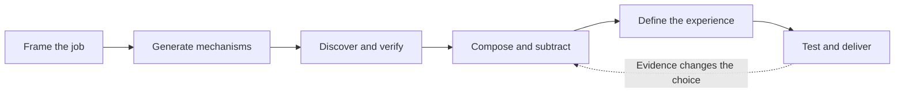

<div align="center">

# Out of the Box

### Creative B2B products. Evidence-backed choices. Lean architecture.

An agent skill that connects **product design**, **technical discovery**, and **purposeful library composition**—from the first hypothesis to a working solution.

[](https://github.com/mateuxcv/skill-out-of-the-box/actions/workflows/validate.yml)
[](https://opencode.ai/docs/skills/)
[](https://agentskills.io/specification)

[Quick start](#quick-start) · [Workflow](#how-it-works) · [Examples](#usage-examples) · [Documentation](#documentation) · [Contributing](#contributing)

</div>

---

## Why this skill?

A valuable business application starts with a job: investigating an exception, reviewing a contract, approving a supplier, or deciding what needs attention next.

**Out of the Box** helps an agent challenge the obvious workflow, discover capabilities beyond its usual stack, and choose an implementation whose complexity is justified by its value.

> **Explore broadly. Select rigorously. Build simply.**

The goal is a distinctive experience with clear technical responsibilities—not a particular framework or a fixed list of libraries.

## What makes it different

| Capability | What the agent does |
| --- | --- |
| **Mechanism-level creativity** | Changes the unit of work, decision sequence, interaction, or coordination—not just colors and layout. |
| **A bold, feasible challenger** | Tests an unfamiliar but useful direction before defaulting to the familiar baseline. |
| **Current technical discovery** | Consults GitHub Trending, problem-oriented search, and primary sources for relevant finalists. |
| **Evidence levels** | Distinguishes discovered candidates, documented capabilities, tested integrations, and measured outcomes. |
| **Composition and subtraction** | Defines what each part owns, then checks whether removing one preserves the distinctive value. |
| **An inspectable design contract** | Specifies the signature interaction, composition, hierarchy, realistic content, keyboard path, and recovery. |
| **Falsifiable experiments** | States what would disprove a direction before committing to its architecture. |
| **Proportional effort** | Uses a focused pass for one interaction and deeper proof for costly or uncertain choices. |

## Quick start

### Requirements

- **OpenCode** with the skill tool available.
- **Git**, or GitHub CLI, to clone the repository.
- Web tools for current research; without them, the agent should label recommendations as provisional.
- **Python 3.10+** only for repository validation and tests. The installed skill itself is Markdown and JSON.

### 1. Clone

```bash
git clone https://github.com/mateuxcv/skill-out-of-the-box.git
cd skill-out-of-the-box
```

Or use `gh repo clone mateuxcv/skill-out-of-the-box`, then enter the cloned directory.

### 2. Open the project

```bash
opencode
```

The skill is already in OpenCode's project discovery directory:

```text
.opencode/skills/out-of-the-box/SKILL.md
```

**Quit and restart OpenCode** if it was already running when the skill was added or changed.

### 3. Give the agent a concrete job

```text
Use the out-of-the-box skill to propose a B2B supplier portal.
Explore different workflow mechanisms, consult GitHub Trending and primary sources,
and compare candidate libraries with the existing stack.
Choose a lean architecture and define the signature interaction and its falsifying test.
```

For a build task, provide the target project, constraints, and implementation scope. The agent should continue through delivery and verification.

### Install in another project or globally

Copy the **entire** `.opencode/skills/out-of-the-box/` directory, including its references, assets, and evaluation cases:

| Scope | Destination |
| --- | --- |
| Another project | `<your-project>/.opencode/skills/out-of-the-box/` |
| Global: macOS/Linux | `~/.config/opencode/skills/out-of-the-box/` |
| Global: Windows | `%USERPROFILE%\.config\opencode\skills\out-of-the-box\` |

Create the destination parent if necessary. Compare existing versions before replacing them, then restart OpenCode. Repository validation scripts and maintainer docs do not need to be installed with the skill.

The agent may recognize relevant tasks from the skill description. To request it explicitly, say **“Use the out-of-the-box skill.”** English skill content does not require English conversation; the agent should follow the user's preferred language.

## How it works



1. **Frame:** identify the actor, friction, baseline, constraints, and decisive uncertainty.
2. **Explore:** compare the best small improvement, a cross-domain transfer, and a recombination of capabilities.
3. **Research:** discover candidates, verify adoption-critical facts, and attach evidence to claims.
4. **Compose:** define ownership and integration contracts; remove parts that add no necessary value.
5. **Design:** make the signature interaction, visual direction, states, and architecture concrete.
6. **Prove:** run the smallest decisive experiment, revise if it fails, and finish the requested scope.

### Depth follows the decision

| Mode | Suitable for | Expected effort |
| --- | --- | --- |
| **Focused** | One interaction or a short deadline | Baseline + meaningful alternative; investigate only decision-changing uncertainty. |
| **Explore** | A new product, workflow, or significant choice | Distinct mechanisms, current discovery, a strong comparison, and a decisive test. |
| **Prove** | Expensive migrations or uncertain integrations | Explore plus an experiment in the target environment before adoption. |

## A concrete example

**Job:** a finance operator switches between several screens to investigate payment discrepancies.

| Direction | Mechanism |
| --- | --- |
| Baseline | Existing table with saved filters and bulk editing. |
| Transfer | An exception inbox with evidence side by side. |
| Recombination | Record comparison, explainable rules, and a resolution preview. |

**Signature interaction:** select a discrepancy, inspect the source records, and resolve it without losing your place in the queue.

**Subtraction test:** if comparison and preview already solve the job, remove the rule engine.

**Falsifier:** if representative cases still require the same external navigation, the proposed interaction has not removed the central friction.

*Illustrative hypotheses—not a customer study or a measured business result.*

## Usage examples

### A distinctive operations workspace

```text
Use the out-of-the-box skill to redesign enterprise support triage.
Operators work by keyboard and compare many records.
Compare distinct compositions, define a signature interaction, and build the flow
with realistic content and recovery states. Preserve the existing design system.
```

### Technical discovery and composition

```text
Use the out-of-the-box skill to evaluate contract-review capabilities.
Research document comparison and contextual annotation libraries.
Verify the relevant versions and integration contract. Compare the combination
with one component or a smaller implementation using our current stack.
```

### Creativity under constraints

```text
Think outside the box to improve this supplier portal.
Add no dependencies or services. Focus on the workflow, information hierarchy,
and removing repeated steps. Implement and verify the selected improvement.
```

### Improving the skill itself

```text
Use out-of-the-box to improve itself.
Inspect a real correction or execution trace, compare improvement directions,
research relevant sources, and make the smallest coherent improvement.
Separate observed problems from expected benefits and report actual validation.
```

## Documentation

| Resource | Purpose |
| --- | --- |
| [Core skill](.opencode/skills/out-of-the-box/SKILL.md) | Operating contract, workflow, and final decision gates. |
| [Creative methods](.opencode/skills/out-of-the-box/references/creative-methods.md) | Assumption challenges, analogies, inversion, and recombination. |
| [Research and selection](.opencode/skills/out-of-the-box/references/research-and-selection.md) | Discovery budget, evidence levels, verification, and composition contracts. |
| [B2B design and architecture](.opencode/skills/out-of-the-box/references/b2b-design-and-architecture.md) | Design contracts, signature interactions, states, and complexity trade-offs. |
| [Decision brief](.opencode/skills/out-of-the-box/assets/decision-brief.md) | Optional template for substantial decisions. |
| [Evaluation guide](.opencode/skills/out-of-the-box/references/evaluation.md) | Fresh-session comparisons and evidence-based grading. |
| [Evaluation cases](.opencode/skills/out-of-the-box/evals/evals.json) | Twelve structured cases, including negative controls. |
| [Self-improvement record](docs/self-improvement.md) | How the skill was applied to this revision, with sources and limits. |
| [Contributing](CONTRIBUTING.md) | Editing conventions and verification commands. |

The core instructions use **progressive disclosure**: detailed references are loaded only when needed. Evaluation materials are for maintainers, not normal product-task context.

## Repository structure

```text
.
├── .github/workflows/validate.yml
├── .opencode/skills/out-of-the-box/
│   ├── SKILL.md
│   ├── references/
│   │   ├── creative-methods.md
│   │   ├── research-and-selection.md
│   │   ├── b2b-design-and-architecture.md
│   │   └── evaluation.md
│   ├── assets/decision-brief.md
│   └── evals/evals.json
├── docs/self-improvement.md
├── scripts/validate_skill.py
├── tests/test_validate_skill.py
├── CONTRIBUTING.md
└── README.md
```

## Validation and evaluation

Run from the repository root:

```bash
python scripts/validate_skill.py
python -m unittest discover -s tests -v
```

The dependency-free validator checks the repository's frontmatter convention, required files, local Markdown file links, and evaluation-case structure. It also checks local file links in maintainer documentation. It does not implement a general YAML/Markdown parser, validate heading anchors, or fetch external URLs.

Tests exercise malformed inputs and missing evidence-case data. Both commands run in GitHub Actions on pushes and pull requests to `main`.

| Evidence | What it establishes |
| --- | --- |
| Structural validation and unit tests | Integrity of this package and behavior of its validator. |
| Author walkthrough | Instruction consistency and expected behavior for reviewed cases. |
| Fresh-session behavioral comparison | Observed outputs and tool use relative to a baseline. |
| Product experiment | A result under the stated project conditions. |

The JSON cases are inputs for evaluation, not an automatic agent runner or recorded passes. Some require an evaluator-provided app or tool setup. Passing CI does not establish creativity, integration readiness, or business impact.

## FAQ

<details>
<summary><strong>Does this require new libraries?</strong></summary>

No. Existing dependencies or native capabilities can win. Every component must contribute necessary value and have a clear responsibility.

</details>

<details>
<summary><strong>Does it always consult GitHub Trending?</strong></summary>

Explore and Prove include current discovery. Focused work uses research when it can affect the decision, and explicit research requests are honored. If web access is unavailable, the agent should disclose the limitation and mark external claims as unverified.

</details>

<details>
<summary><strong>Does it work with other agents?</strong></summary>

The files use the Agent Skills format. Installation and workflow documentation target OpenCode. Other agents need compatible discovery and tools; operational compatibility with them has not been established here.

</details>

<details>
<summary><strong>Does it need a specific MCP server?</strong></summary>

No. It uses the agent's available research, editing, and verification tools. It adds instructions, not permissions or external services.

</details>

<details>
<summary><strong>When should it stay inactive?</strong></summary>

Mechanical edits, isolated bug fixes, and documentation lookups without a creative product or architecture decision should remain focused on their original task.

</details>

## Contributing

Concrete failure cases, better experiments, and simplifications are especially useful. Read [CONTRIBUTING.md](CONTRIBUTING.md), open an [issue](https://github.com/mateuxcv/skill-out-of-the-box/issues), or submit a focused pull request with evidence.

## References

- [Agent Skills specification](https://agentskills.io/specification)
- [Skill-authoring best practices](https://agentskills.io/skill-creation/best-practices)
- [Evaluating skill output quality](https://agentskills.io/skill-creation/evaluating-skills)
- [OpenCode skills documentation](https://opencode.ai/docs/skills/)
- [GitHub Trending](https://github.com/trending?since=weekly)

---

<div align="center">

Created by [Mateus Victor](https://github.com/mateuxcv).<br>
**Explore broadly. Build with purpose.**

</div>
